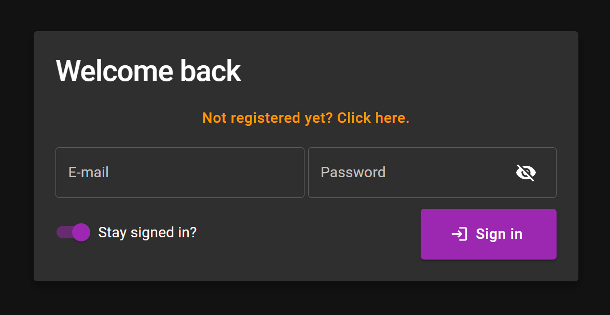
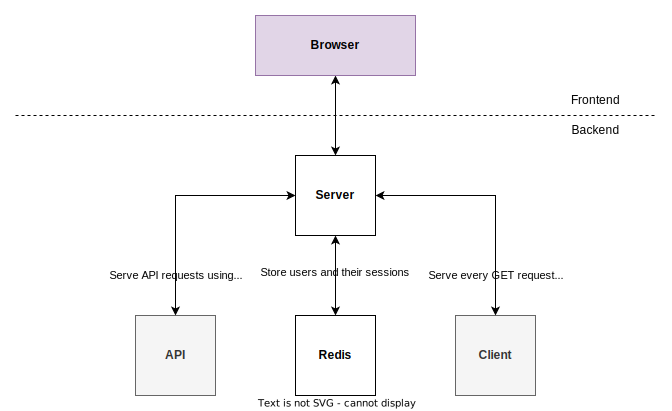

# DummyAuthenticator
## Description
This is a simple Node application, which demonstrates how server-side authentication using user sessions can be implemented. Sessions are stored on the server using a Redis store when running the app (a simple key-value in-memory store can also be used during development).

## Features
- **Registration**: Sign up as a new user by providing basic information.
- **Login**: Log in to access authenticated parts of the application.
- **Logout**: Log out of the application.
- **Password Reset**: Reset your password via email verification (using JWT tokens), or directly in the app in case you're already logged in.
- **Protection against Bruteforce Attacks**: Only allow users a given number of failed login attempts per hour to avoid repeated authentication attempts.

## Setup
Ensure Docker is installed on your machine, along with its Compose feature. Inside the project's root directory, execute the following command:
```
docker compose up
```

To test the app, navigate to `http://localhost` in your browser.

## User Interface (UI)
The application allows for easy navigation through user registration, login, logout, and password reset functionalities.

<p align="center" width="100%">
  
</p>

## Architecture
- **Server**: Authentication server based on Express.
- **Client**: Simple authentication client app based on React.
- **API**: Set of controllers allowing authentication processes: user registration, login, logout, and password recovery.
- **Redis**: persisting of users and their sessions.

Below is a diagram of the architecture of this app. For now, the broker is responsible of the communication with the browser. There is no frontend, per se, that's part of this prototype.

<p align="center" width="100%">
  
</p>
